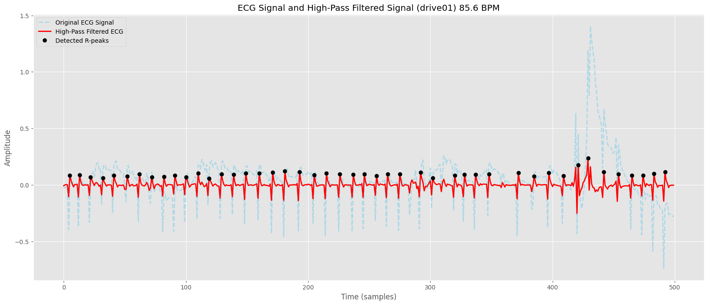
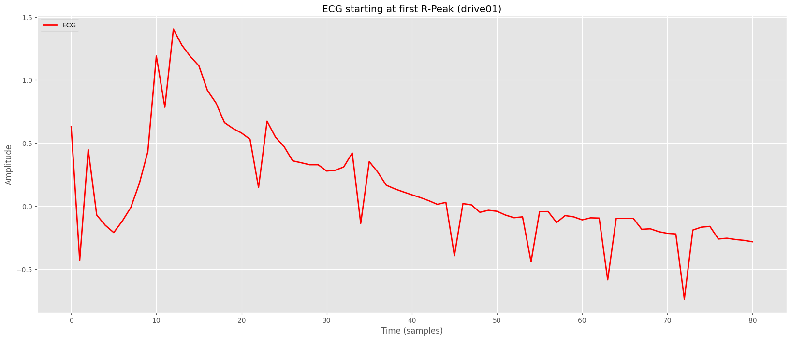
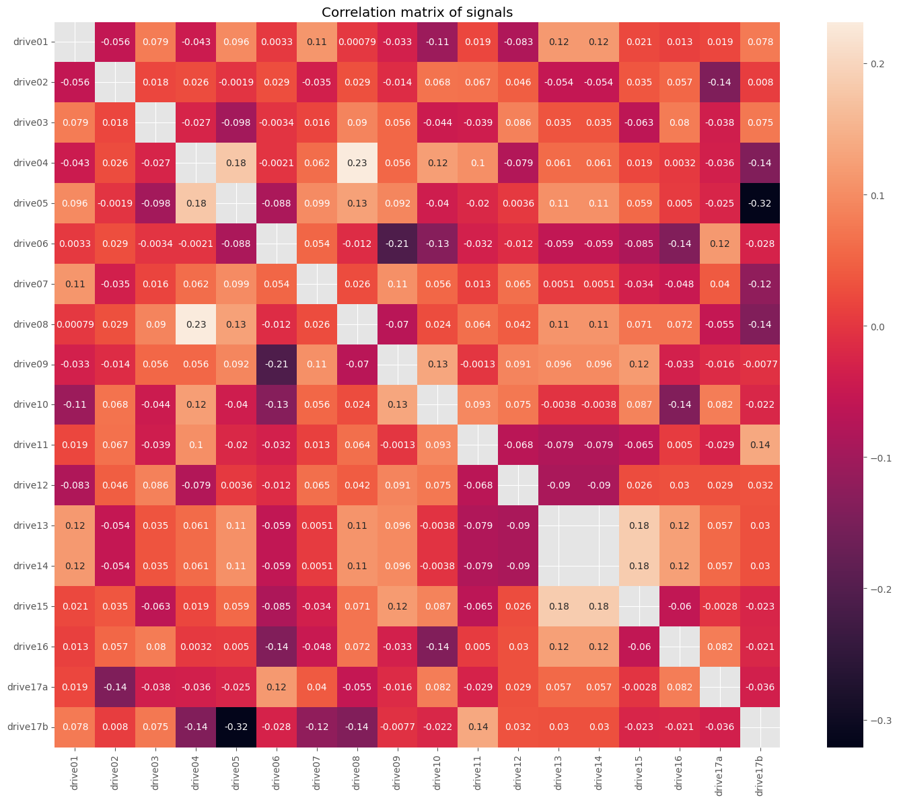
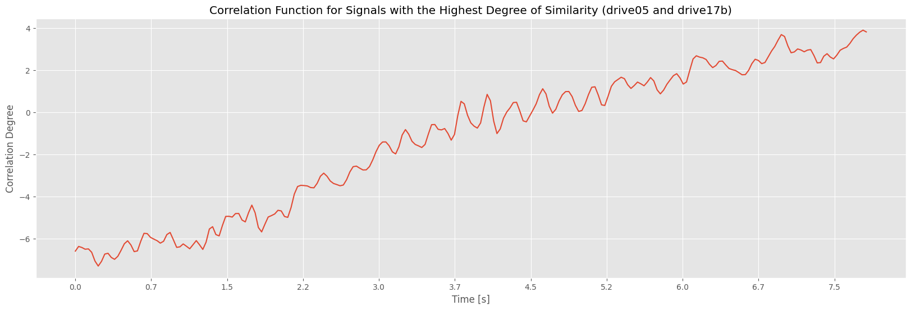
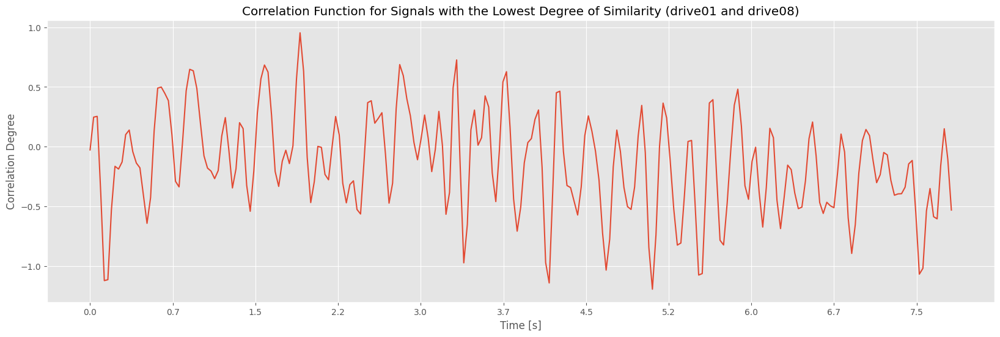
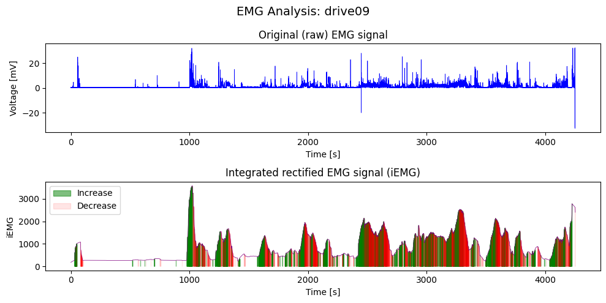

# Seminární práce I: Výpočet tepové frekvence z EKG signálu

- Tým: Radek Šmejkal, Martin Formánek
- 28.1.2025
- [Kódová část](SeminarniPrace-I(1).ipynb)
- [Zadání](SeminarniPrace-I.pdf)

## I. Zadání
Ve zdrojové databázi najdete celkem 17 měření EKG signálu. Signál je již filtrován a
centralizován kolem podélné osy. EKG signál obsahuje dominantní peaky, které se nazývají R
vrcholy. Vzdálenost těchto vrcholů určuje dobu mezi jednotlivými tepy. Počet tepů za minutu
je tedy počet R vrcholů v signálu o délce jedné minuty. Navrhněte algoritmus, který bude
automaticky detekovat počet R vrcholů v EKG signálech a prezentujte tepovou frekvenci při
jednotlivých jízdách/měřeních. Vás algoritmus následně otestujte na databázi MIT-BIH
https://physionet.org/content/nsrdb/1.0.0/ a prezentujte jeho úspěšnost vzhledem
k anotovaným datům z databáze.


## II. Postup řešení
### 1. Odstranění šumu a nízkofrenkvenčních složek
Nejprve bylo potřeba odstranit šum a nízkofrekvenční složky, aby R-vrcholy v signálu vynikly.
```python
    def high_pass_filter(signal, samp_rate, cutoff_freq=40):
    tau = 1 / (2 * np.pi * cutoff_freq)
    alpha = tau / (tau + 1 / (2 * np.pi * samp_rate))
    y_prev = 0
    x_prev = 0

    filtered_signal = []
    for x in signal:
        y = alpha * (y_prev + x - x_prev)
        filtered_signal.append(y)
        y_prev = y
        x_prev = x

    return np.array(filtered_signal)
```
### 2. Detekce R-vrcholů
Poté byla provedena detekce R-vrcholu, kde byly identifikovány hodnoty signálu nad prahovou hodnotou a určen maximální bod v každém segmentu. Prahová hodnota byla určena pomocí N-tého percentilu hodnot signálu, což zajišťuje částečně dynamický přístup. U některých signálů však může stále docházet k problémům s přesností prahové hodnoty, protože případné anomálie mohou percentil snadno ovlivnit.
```python
    threshold = np.percentile(signal, p_threshold)
    above_threshold = signal > threshold
    diff = np.diff(above_threshold.astype(int))
    rise = np.where(diff == 1)[0] + 1 
    fall = np.where(diff == -1)[0] + 1 
    
    if above_threshold[0]:
        rise = np.insert(rise, 0, 0)
    if above_threshold[-1]:
        fall = np.append(fall, len(signal))
    
    peaks = []
    peaks_values = []
    for start, end in zip(rise, fall):
        segment = signal[start:end]
        if len(segment) == 0:
            continue
        max_idx = np.argmax(segment)
        peak_idx = start + max_idx
        peaks.append(peak_idx)
        peaks_values.append(signal[peak_idx])
```
### 3. Filtrování falešných R-vrcholů
Nakonec byly odstraněny potenciální falešné R-vrcholy na základě minimální vzdálenosti mezi vrcholy a výšky jednotlivých vrcholů.
```python
    if min_distance > 0:
        peaks = np.array(peaks)
        peaks_values = np.array(peaks_values)
        sorted_indices = np.argsort(peaks_values)[::-1]
        sorted_peaks = peaks[sorted_indices]
        
        filtered_peaks = []
        used = np.zeros(len(signal), dtype=bool)
        
        for peak in sorted_peaks:
            if used[peak]:
                continue
            start = max(0, peak - min_distance)
            end = min(len(signal), peak + min_distance + 1)
            if not used[start:end].any():
                filtered_peaks.append(peak)
                used[start:end] = True
        
        filtered_peaks = np.sort(filtered_peaks)
        peaks = filtered_peaks.tolist()
        peaks_values = signal[filtered_peaks].tolist()
    
    if min_peak_height is not None:
        peaks = [peak for peak in peaks if signal[peak] >= min_peak_height]
        peaks_values = [signal[peak] for peak in peaks]
```
## III. Výsledky
Po zpracování dat z databáze MIT-BIH jsme obdrželi následující průměrné metriky:
```
File: 16265 | TP: 100963, FP: 3300, FN: 414 | Precision: 0.97, Recall: 1.00, F1-Score: 0.98
File: 16272 | TP: 98492, FP: 14122, FN: 4312 | Precision: 0.87, Recall: 0.96, F1-Score: 0.91
File: 16273 | TP: 90544, FP: 8578, FN: 162 | Precision: 0.91, Recall: 1.00, F1-Score: 0.95
File: 16420 | TP: 102980, FP: 2405, FN: 282 | Precision: 0.98, Recall: 1.00, F1-Score: 0.99
File: 16483 | TP: 108187, FP: 17013, FN: 109 | Precision: 0.86, Recall: 1.00, F1-Score: 0.93
File: 16539 | TP: 109565, FP: 7138, FN: 298 | Precision: 0.94, Recall: 1.00, F1-Score: 0.97
File: 16773 | TP: 109054, FP: 16894, FN: 4926 | Precision: 0.87, Recall: 0.96, F1-Score: 0.91
File: 16786 | TP: 101776, FP: 9113, FN: 76 | Precision: 0.92, Recall: 1.00, F1-Score: 0.96
File: 16795 | TP: 114147, FP: 4320, FN: 692 | Precision: 0.96, Recall: 0.99, F1-Score: 0.98
File: 17052 | TP: 88156, FP: 2520, FN: 372 | Precision: 0.97, Recall: 1.00, F1-Score: 0.98
File: 17453 | TP: 103183, FP: 7427, FN: 367 | Precision: 0.93, Recall: 1.00, F1-Score: 0.96
File: 18177 | TP: 116967, FP: 2275, FN: 496 | Precision: 0.98, Recall: 1.00, F1-Score: 0.99
File: 18184 | TP: 105467, FP: 20897, FN: 142 | Precision: 0.83, Recall: 1.00, F1-Score: 0.91
File: 19088 | TP: 99815, FP: 390, FN: 18180 | Precision: 1.00, Recall: 0.85, F1-Score: 0.91
File: 19090 | TP: 81800, FP: 785, FN: 326 | Precision: 0.99, Recall: 1.00, F1-Score: 0.99
File: 19093 | TP: 84064, FP: 9474, FN: 6027 | Precision: 0.90, Recall: 0.93, F1-Score: 0.92
File: 19140 | TP: 96854, FP: 887, FN: 190 | Precision: 0.99, Recall: 1.00, F1-Score: 0.99
File: 19830 | TP: 110894, FP: 1067, FN: 806 | Precision: 0.99, Recall: 0.99, F1-Score: 0.99

Average Metrics: Precision: 0.94, Recall: 0.98, F1-Score: 0.96
```
Z těchto metrik je patrné, že u některých signálů docházelo k chybné detekci vrcholů, zatímco u jiných k jejich neoznačení. Tento jev je pravděpodobně způsoben percentilovou hranicí, která je u některých signálů příliš nízká, u jiných zase příliš vysoká, což ovlivňuje přesnost detekce.




### Závěr

Algoritmus pro detekci R vrcholů v EKG signálech dosahuje relativně vysoké přesnosti a spolehlivosti, díky ručně nastavené hodnotě percentilu. K dosažení automatizace nastavování hodnoty percentilu, případně přímo pro zpracovávání by se dal využít model strojového učení, který by byl schopný dosáhnout ještě lepších výsledků.

# Seminární práce I: Výpočet korelace EKG signálů

- Tým: Radek Šmejkal, Martin Formánek
- 28.1.2025
- [Kódová část](SeminarniPrace-I(2).ipynb)
- [Zadání](SeminarniPrace-I.pdf)

## I. Zadání
Ve zdrojové databázi najdete celkem 17 měření obsahující EKG signál. Signály jsou již filtrované
a centralizované kolem podélné osy. Různá měření jsou získána s různou vzorkovací frekvencí.
U všech signálů analyzujte vzorkovací frekvenci a proveďte sjednocení na tu dominantní z nich.
Pro tyto převzorkované signály proveďte korelační analýzu a prezentujte, jak jsou si signály
napříč měřeními podobné. Pro smysluplné provedení této analýzy je potřeba nejprve srovnat
signály na stejný počátek, např. dle pozice prvního dominantního R peaku. Protože se délky
jednotlivých signálů neshodují, je také nutné zvolit vhodnou délku korelační funkce, a to
například analýzou autokorelačních funkcí samostatných signálů.


## II. Postup řešení
### 1. Sjednocení na dominantní frekvenci
Nejprve bylo potřeba sjednotit frekvence signálů, `target_fs` v tomto případě znamená nejvyšší frekvence ze všech signálů.
```python
def resample_signal(signal, original_fs, target_fs):
    num_samples = int(len(signal) * target_fs / original_fs)
    resampled_signal = sp_signal.resample(signal, num_samples)
    return resampled_signal
```
### 2. Srovnání počátků jednotlivých signálů
Bylo potřeba odstranit části signálu před prvním R-vrcholem, tak aby signály začínaly stejně. V rámci tohoto kroku se využívá stejná funkce pro detekování vrcholů jako v první části seminární práce.
```python
    def trim_to_peak(signals, p_threshold=95, min_distance=3, min_peak_height=0.01):
    processed_signals = []

    for signal in signals:
        rpeaks, _ = detect_peaks(
            signal,
            p_threshold=p_threshold,
            min_distance=min_distance,
            min_peak_height=min_peak_height,
        )

        first_rpeak = rpeaks[0]
        trimmed_signal = signal[first_rpeak:]

        processed_signals.append(trimmed_signal)

    return processed_signals
```

## III. Výsledky




### Závěr

Korelační matice ukazuje, že mezi signály není moc vysoká míra korelace. Nejvyšší míra korelace je mezi signály drive05 a drive17b a naopak nejnižší byla u drive01 a drive08. Nízká korelace může být způsobena také anomáliemi, které by za normálních podmínek bylo potřeba odstranit, aby byl výstup přínosný.

# Seminární práce I: Klasifikace EMG signálů

- Tým: Radek Šmejkal, Martin Formánek
- 28.1.2025
- [Kódová část](SeminarniPrace-I(3).ipynb)
- [Zadání](SeminarniPrace-I.pdf)

## I. Zadání
Ve zdrojové databázi najdete celkem 17 měření EMG signálu. Signál je již filtrován a
centralizován kolem podélné osy. EMG signály zachycují aktivitu svalů během jízdy. Pro všech
17 měření spočítejte integrované EMG (iEMG) pomocí vzorce:

$\displaystyle \text{iEMG} = \int_{0}^{t} |f(t)| \, d t$


kde, t je doba záznamu, 𝑓(𝑡) je EMG signál a | | symbolizuje absolutní hodnotu. Dále
detekujte oblasti, kde u jednotlivých signálů dochází k nárůstu a poklesu aktivity, a to pomocí
okénkové varianty iEMG a derivace funkce. Velikost okénka zvolte tak, aby byly výsledky
statisticky spolehlivé.


## II. Postup řešení
Nejprve bylo potřeba využít funkci pro absolutní hodnotu `np.abs(signal)` následně pomocí funkce `np.convolve(rectified_signal, np.ones(int(windowsize), mode="same")` byla provedena integrace, tím vznikl iEMG signál. Následně z jeho derivace `np.diff(signal)` lze zjistit, zda se jedná o klesající, nebo stoupající část, zde bylo potřeba zahrnout i threshold, nebo-li prahovou hodnotu, protože EMG signál je většinu času jen klesající, stoupající je pouze nárazově.

## III. Výsledky


Průměrné hodnoty iEMG v rámci jednotlivých jízd:
```
iEMG record drive01: 1.81 mV·s
iEMG record drive05: 300.14 mV·s
iEMG record drive06: 262.11 mV·s
iEMG record drive07: 44.75 mV·s
iEMG record drive08: 69.87 mV·s
iEMG record drive09: 279.33 mV·s
iEMG record drive10: 215.59 mV·s
iEMG record drive11: 67.69 mV·s
iEMG record drive12: 66.98 mV·s
iEMG record drive13: 240.79 mV·s
iEMG record drive14: 240.79 mV·s
iEMG record drive15: 228.28 mV·s
iEMG record drive16: 226.82 mV·s
iEMG record drive17a: 124.01 mV·s
iEMG record drive17b: 131.53 mV·s
```

### Závěr
Z výsledků vyplývá, že mezi jednotlivými signály existují výrazné rozdíly. V rámci této části by nejspíše ani nebylo potřeba vylepšovat funkci strojovým učením, pouze při nějaké hlubší analýze EMG signálu a analýze případných korelaci mezi nimi. 


## Použité zdroje
- [Numpy dokumentace](https://numpy.org/doc/)
- [Matplotlib dokumentace](https://matplotlib.org/3.5.3/api/_as_gen/matplotlib.pyplot.html)
- [Seaborn dokumentace](https://seaborn.pydata.org/)
- [Wfdb dokumentace](https://wfdb.readthedocs.io/en/latest/)

