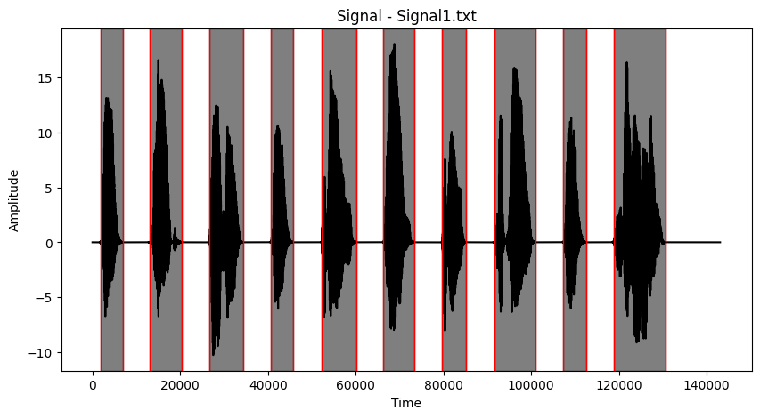
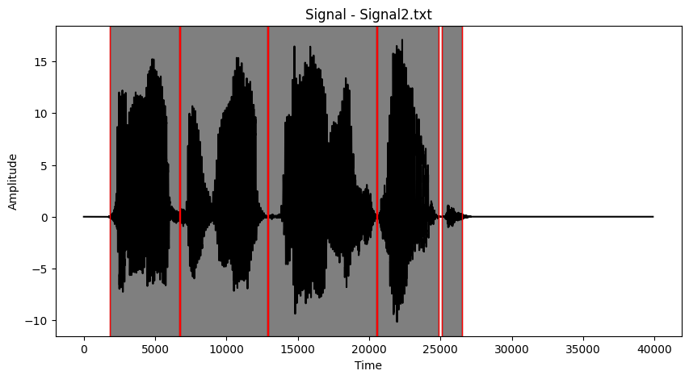
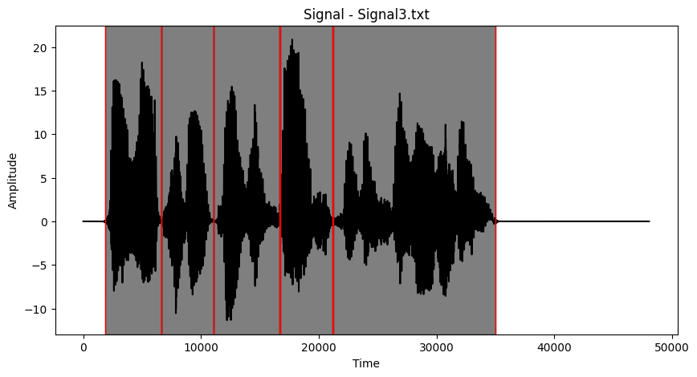

# Seminární práce: Detekce a přiřazení slov v záznamu řeči

- Tým: Radek Šmejkal, Martin Formánek
- 28.1.2025
- [kódová část](SeminarniPrace-II.ipynb)

## I. Zadání

Ve zdrojovém souboru Signal1.txt a na Obrázku 1 najdete záznam řeči převedený na signál,
resp. časovou řadu. Pomocí metod analýzy signálu v časové oblasti, frekvenční oblasti nebo
jejich kombinací identifikujte jednotlivá slova v záznamu. Vybírejte z následujícího seznamu
slov.

```
time, prepare, solution, make, mistake, no, the, probable, long, lecture, method, disaster, fail,
work, advice, idea, succeed, easy, is, for, give.
```

Vámi navržený algoritmus vyzkoušejte na záznamech Signal2.txt a Signal3.txt a identifikujte
slova i v těchto dvou časových řadách. V případě potřeby algoritmus dále vylepšete. Kromě
metod probraných při hodinách lze pro identifikaci jednotlivých slov využít například některé
další funkce, například Hammingova funkce nebo Hilbertova transformace, případně jakoukoli
další metodu, kterou uznáte za vhodnou, vyjma metod založených na strojovém učení.

## II. Postup řešení

### 1. Generování referenčních vzorků
Pro správné přiřazení slov v záznamu byly vytvořeny referenční vzorky pro všechna slova ze seznamu. Knihovna Pyttsx3 nám umožnila vytvořit z textu wav nahrávku.

```python
def generate_audio_files(words, directory="audio_files"):
    os.makedirs(directory, exist_ok=True)
    tts_engine = pyttsx3.init()
    audio_data = []

    for word in words:
        file_path = os.path.join(directory, f"{word}.wav")
        tts_engine.save_to_file(word, file_path)
        tts_engine.runAndWait()

        try:
            sample_rate, signal = wav.read(file_path)
            audio_data.append((word, signal, sample_rate))
        except Exception as error:
            print(f"Error reading {file_path}: {error}")

    return audio_data
```

### 2. Zpracování signálu

Pro zpracování signálů slouží funkce `trim_speech()`, která slouží k odstranění částí pod prahovou hodnotou amplitudy a funkce `pad_speech()`, která upravuje délku signálu tak, aby byly stejné. Pokud je jeden signál delší, je ten druhý doplněn nulami, aby měly oba stejnou délku.

```python
def trim_speech(signal, threshold=50):
    signal[np.abs(signal) < threshold] = 0
    return np.trim_zeros(signal)
```

```python
def pad_speech(s1, s2):
    trimmed_s1, _, _ = trim_speech(s1)
    trimmed_s2, _, _ = trim_speech(s2)
    max_size = max(trimmed_s1.size, trimmed_s2.size)
    padded_s1 = np.pad(trimmed_s1, (0, max_size - trimmed_s1.size))
    padded_s2 = np.pad(trimmed_s2, (0, max_size - trimmed_s2.size))
    return padded_s1, padded_s2
```

### 3. Extrakce příznaků

Pro extrakci příznaků byla využita knihovna Librosa, umožňuje výpočet MFCC, spekrálního centroidu a chroma features.

```python
def extract_features(y, sr, n_fft=2048, n_mfcc=40):
    y = librosa.util.normalize(y.astype(np.float32))
    sY = librosa.feature.melspectrogram(y=y, sr=sr, n_fft=n_fft)
    mfccsY = librosa.feature.mfcc(S=librosa.power_to_db(sY), n_mfcc=n_mfcc)
    scY = librosa.feature.spectral_centroid(y=y, sr=sr, n_fft=n_fft)
    chromaY = librosa.feature.chroma_stft(y=y, sr=sr, n_fft=n_fft)

    return mfccsY, scY, chromaY
```

### 4. Identifikace slov

Pro indetifikaci slov byla použita hausdorffova vzdálenost `directed_hausdorff()`, která je aplikována na již zmíněné příznaky. Tato metoda umožnila porovnání segmentů s referenčními vzorky. Nižší hodnoty vzdálenosti znamenají lepší shodu mezi segmentem a referenčním slovem.

## III. Výsledky

### Signal1.txt



**Odhadnutá věta:**
- `the make method the time make for prepare the solution`

**Nejlepší shody:**

```
[('the', 1875.0971), ('for', 2531.9378), ('give', 2888.8433), ('make', 2899.8160)]
[('make', 1191.6083), ('give', 1792.1121), ('work', 2629.7754), ('method', 2884.9072)]
[('method', 2332.0413), ('lecture', 2440.9348), ('long', 2664.1358), ('fail', 2750.5176)]
[('the', 1908.3859), ('for', 2585.3438), ('make', 2796.7344), ('no', 2933.2106)]
[('time', 1350.4929), ('for', 2221.5635), ('fail', 2599.8906), ('probable', 2981.9201)]
[('make', 2426.9802), ('method', 2438.2310), ('for', 2457.5660), ('long', 2619.1246)]
[('for', 2412.4082), ('time', 2967.9019), ('give', 3330.1263), ('probable', 3483.1991)]
[('prepare', 2490.2428), ('idea', 2712.7028), ('for', 3009.1519), ('lecture', 3233.2509)]
[('the', 1972.7489), ('no', 2141.3093), ('make', 2443.8096), ('give', 2565.2708)]
[('solution', 3984.7833), ('for', 4802.2892), ('probable', 5068.3214), ('succeed', 5116.7893)]
```

---

### Signal2.txt



**Odhadnutá věta:**
- `the give give for for`

**Nejlepší shody:**

```
[('the', 1292.2832), ('make', 2822.4815), ('no', 2944.5079), ('give', 3163.4781)]
[('give', 2461.7777), ('make', 2526.5312), ('for', 2702.4065), ('method', 3116.9301)]
[('give', 2493.7271), ('make', 2539.3444), ('no', 3202.9205), ('easy', 3396.5460)]
[('for', 2626.0344), ('the', 3025.6298), ('time', 3347.2934), ('give', 3394.1290)]
[('for', 2896.9630), ('give', 4545.1654), ('time', 4596.3303), ('the', 4786.7402)]
```

---

### Signal3.txt



**Odhadnutá věta:**
- `the for for lecture lecture`

**Nejlepší shody:**

```
[('the', 2424.8502), ('for', 2789.6771), ('make', 2933.7316), ('no', 2964.6416)]
[('for', 2506.2788), ('time', 3477.0065), ('give', 3841.0644), ('the', 3905.5231)]
[('for', 1969.8831), ('give', 2393.8407), ('the', 2717.0781), ('make', 2782.9566)]
[('lecture', 3672.3102), ('is', 4228.0236), ('the', 4352.5036), ('make', 4489.8218)]
[('lecture', 4186.6286), ('idea', 4672.2336), ('succeed', 5155.0184), ('method', 5272.6060)]
```

### Závěr

- Algoritmus je schopný rozdělit pomalu řečenou větu celkem s jistotou, ale má opravdu velké problémy s rychlou řečí. Detekce slov jako takových je celkem nepřesná, největším problémem je připravit vygenerovaný signál a úryvek nahrávky tak, aby se daly smysluplně porovnat. Hledat shodu v rámci nahrávek je opravdu složité a vyžadovalo by modely strojového učení pro zlepšení přesnosti.

## Použité zdroje

- [Librosa dokumentace](https://librosa.org/doc/latest/index.html)
- [SciPy signal processing](https://docs.scipy.org/doc/scipy/tutorial/signal.html)
- [Pyttsx3 dokumentace](https://pyttsx3.readthedocs.io)
